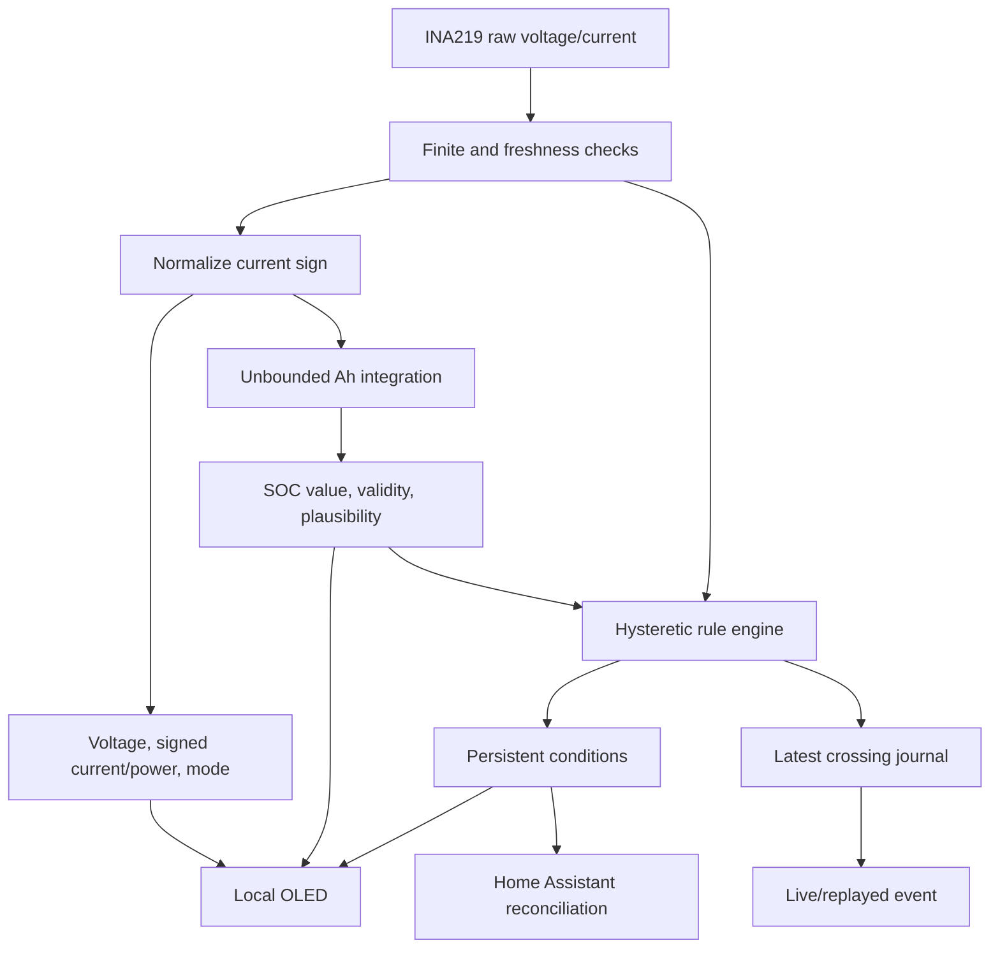

# Firmware architecture

This document explains how the stabilized firmware is structured and why its
state, availability, and event behavior are deliberately conservative. It is an
engineering reference, not a construction or commissioning shortcut.

> **Current scope:** The repository is a prototype. The complete physical monitor
> has not passed the commissioning checklist, and no real charger or load
> automation has been validated. Calibration workflows, automatic endpoint
> qualification, capacity learning, a productized Home Assistant dashboard, and
> local actuation remain future work.

## Canonical composition

[`../battery-monitor.yaml`](../battery-monitor.yaml) is the default ESP32-C3
entry point. The alternative
[`../battery-monitor-esp8266.yaml`](../battery-monitor-esp8266.yaml) reuses the same
six packages with platform-specific overrides documented in
[`esp8266-migration.md`](esp8266-migration.md):

| Package                                                              | Responsibility                                                                                                 |
| -------------------------------------------------------------------- | -------------------------------------------------------------------------------------------------------------- |
| [`../packages/battery-config.yaml`](../packages/battery-config.yaml) | Compile-time hardware/timing substitutions and runtime-setting defaults                                        |
| [`../packages/connectivity.yaml`](../packages/connectivity.yaml)     | Wi-Fi, encrypted native API, OTA, time, diagnostics, and reconnect replay                                      |
| [`../packages/measurement.yaml`](../packages/measurement.yaml)       | I2C, INA219 inputs, sign normalization, derived power/mode, freshness, and stale invalidation                  |
| [`../packages/soc.yaml`](../packages/soc.yaml)                       | Runtime capacity/efficiency, unbounded Ah integration, validity, plausibility, checkpoints, and manual anchors |
| [`../packages/soc-rules.yaml`](../packages/soc-rules.yaml)           | Runtime thresholds, hysteretic latches, authoritative conditions, event journal, and event delivery            |
| [`../packages/display.yaml`](../packages/display.yaml)               | Local measurement, SOC, health, connectivity, and rule-status pages                                            |

Shared fixed-record and pure helper logic lives in
[`../include/battery_monitor_types.h`](../include/battery_monitor_types.h). Host
tests exercise those helpers in
[`../tests/battery_monitor_helpers_test.cpp`](../tests/battery_monitor_helpers_test.cpp).

The packages are implementation boundaries, not independent products. Hardware
settings such as shunt resistance, pins, addresses, and polarity are compile-time
because changing them without a corresponding build could make readings
temporarily misleading. Capacity, charging efficiency, rule levels, and
hysteresis are persistent runtime controls exposed to Home Assistant.

## Data flow



No downstream consumer uses an independently inverted current formula. One
normalization stage establishes the public sign convention:

- positive current and power mean charging;
- negative current and power mean discharging.

## Measurement validity and freshness

The INA219 package publishes raw sensor channels only when values are finite.
Normalized current and signed power derive from the same raw-current sample.

`Measurement Healthy` requires:

- at least one current sample;
- a sample age no greater than the configured stale interval;
- finite Battery Voltage; and
- finite Battery Current.

If current samples become stale, firmware invalidates voltage, current, power,
raw diagnostics, shunt voltage, and charging/discharging/idle states. It does not
publish fabricated zeroes. The rule engine becomes unready, and SOC integration
does not bridge the missing interval.

When samples return, the first valid current sample establishes a new monotonic
timing baseline. Integration resumes only from later valid intervals.

The charging/idle/discharging deadband is classification only. Current inside the
deadband still enters Ah integration so small real current and sensor offset
remain visible in long-term SOC behavior.

## Unbounded Ah and SOC model

Live remaining capacity is an unbounded Ah accumulator. Positive normalized
current adds charge after charging-efficiency compensation; negative current
removes charge without that compensation.

<details>
<summary>Integration and SOC formulas</summary>

For an accepted interval:

```text
effective_current_A = current_A * efficiency_percent / 100  when current_A > 0
effective_current_A = current_A                             when current_A <= 0

delta_Ah = effective_current_A * elapsed_ms / 3,600,000
remaining_Ah = previous_remaining_Ah + delta_Ah
SOC_percent = remaining_Ah / rated_capacity_Ah * 100
```

The monotonic millisecond subtraction is rollover safe. Zero-length intervals and
intervals beyond the configured maximum sample gap are discarded and counted
rather than integrated.

</details>

SOC is deliberately not clamped to 0–100%. Clamping would hide evidence of:

- current offset or gain error;
- capacity mismatch;
- charging-efficiency error;
- incorrect endpoint anchoring;
- lost integration after power interruption; or
- wiring/polarity faults.

## Validity and plausibility are different

The firmware tracks separate concepts:

- **Invalid:** no trusted restored/manual anchor exists, or the operator explicitly
  invalidated SOC. Trusted State of Charge and rule conditions are unavailable.
- **Valid, not suspect:** an anchor exists and the unbounded percentage is inside
  configured plausibility limits.
- **Valid, suspect:** an anchor exists, but the percentage is outside the
  plausibility limits. The value remains visible and continues to drive
  conditions while the diagnostic warning is on.

Set Battery Full assigns remaining Ah to rated capacity and marks SOC valid. Set
Battery Empty assigns zero Ah and marks SOC valid. Invalidate SOC preserves the
diagnostic estimate while removing trust and suppressing authoritative rules.

These controls do not inspect cells, voltage, current direction, temperature,
BMS state, or endpoint dwell. Endpoint qualification is an operator/manufacturer
responsibility in the stabilized firmware.

Changing Rated Battery Capacity rescales remaining Ah so the current unbounded SOC
percentage is preserved. It does not silently reinterpret the same remaining Ah
as a different percentage.

## Checkpoints and flash wear

Live Ah updates at measurement cadence but is not written to flash on every
sample. A five-word checkpoint stores:

- magic value;
- schema version;
- float bits for remaining Ah;
- float bits for capacity Ah; and
- validity flags.

The record is prepared with its magic value written last, so an incomplete
in-memory update is invalid. The complete fixed-size array is one ESPHome
preference object.

Capacity is also an ESPHome number preference. Recording capacity on both sides
of the checkpoint ratio allows restore logic to preserve the same SOC percentage
if capacity and checkpoint preference writes were interrupted at different times.

<details>
<summary>Default persistence timing and abrupt-power-loss exposure</summary>

With the default ESP32-C3 entry point:

- live state is staged to the checkpoint every 60 seconds;
- restored records are polled for changes every 1 second;
- physical preference writes are coalesced for 5 seconds;
- manual anchors, capacity edits, and invalidation stage a checkpoint immediately,
  but physical flash write still follows polling/coalescing; and
- graceful shutdown stages a checkpoint, but abrupt power removal cannot rely on
  the callback.

The documented approximate accounting exposure is therefore 66 seconds plus
normal scheduling uncertainty:

```text
approximate maximum lost Ah = abs(current_A) * 66 / 3600
```

Reducing this interval trades accounting exposure against flash-write frequency
and requires its own validation.

The ESP8266 entry point uses 15-minute checkpoints and 60-second flash write
coalescing. Its longer loss window and interrupted flash-commit behavior are
documented in [`esp8266-migration.md`](esp8266-migration.md).

</details>

After boot, the first valid current sample establishes timing. Firmware never
integrates across downtime.

## Rule configuration and readiness

Three compile-time rule identities have persistent runtime level/hysteresis
settings:

| Rule             | Direction | Default level | Default hysteresis |
| ---------------- | --------- | ------------: | -----------------: |
| Stop Charge      | Upward    |           95% |                 2% |
| Capacity Warning | Downward  |           40% |                 2% |
| Stop Load        | Downward  |           30% |                 2% |

Configuration is valid only when all values are finite, all hysteresis values are
nonnegative, and levels are strictly ordered:

```text
Stop Load < Capacity Warning < Stop Charge
```

Rule-engine readiness additionally requires valid SOC, fresh measurements, and a
completed startup/settings baseline. Authoritative rule conditions are unavailable
while the engine is unready.

An upward latch asserts at or above its level and clears at or below level minus
hysteresis. A downward latch asserts at or below its level and clears at or above
level plus hysteresis.

Startup, measurement recovery, SOC anchoring/invalidation, capacity edits, and
rule-setting edits reconstruct/baseline conditions without fabricating a crossing
event. A crossing event is created only for an armed clear-to-assert transition.

Latch state is persisted in a separate fixed record. On boot inside a hysteresis
band, firmware preserves/reconstructs prior state rather than arbitrarily choosing
the opposite condition.

## Persistent conditions and transient events

Persistent binary-sensor conditions are the current source of truth for Home
Assistant reconciliation:

- Stop Charge Requested;
- Capacity Warning Active; and
- Stop Load Requested.

Crossing events are supplementary notification/reconciliation hints. A transient
event can be missed while Home Assistant or the network is unavailable.

For each real asserted crossing, firmware stores a latest-event journal containing
a nonzero 32-bit sequence, rule, direction, SOC snapshot, uptime, wall-clock time
when valid, and validity/suspect flags. Metadata entities are published before the
custom Home Assistant event.

On native API connection, firmware waits two seconds, republishes the latest
metadata, and emits the same record with its original sequence and a replay label.
Consumers deduplicate equal sequences. They must not require every next sequence
to be numerically larger because the counter wraps from `4294967295` to `1`.

<details>
<summary>Latest-event journal limitations</summary>

The journal stores one latest crossing, not a lossless queue. Several crossings
during a long outage cannot all be replayed later. Persistent conditions still
reconstruct the current requested action.

A physical power failure before preference flush can roll back the stored latest
sequence within the configured write window. Sequence reuse after a complete
32-bit cycle is theoretically possible; consumers that must distinguish such a
case can also retain timestamp/uptime evidence.

</details>

The complete payload and conservative Home Assistant examples are in
[`home-assistant.md`](home-assistant.md).

## Offline behavior

Wi-Fi and native API reboot timeouts are disabled. Loss of Wi-Fi or Home Assistant
does not intentionally reboot the monitor. While sensor input and local power
remain healthy, these functions continue locally:

- INA219 measurement;
- Ah/SOC integration;
- plausibility and rule evaluation;
- persistent condition updates;
- latest-event journaling; and
- OLED status display.

`Device Online` describes the native API connection, not the health of every
local function. A network-dependent charger/load action remains supplementary and
must have independent safe behavior.

## OLED state model

The display rotates through three pages:

1. voltage, signed current, signed power, charge/load/idle, and API status;
2. trusted unbounded SOC and remaining/rated Ah, or `SOC NOT SET`; and
3. SOC validity/plausibility and authoritative condition states, with `n/a` while
   the rule engine is unready.

If measurement health fails, a dedicated `SENSOR UNAVAILABLE` page replaces all
normal pages so stale values cannot look current.

The two-color OLED reserves its 16-row yellow band for a compact status line;
all values and instructions fit into the other 48 rows. The default 180-degree
mounting puts yellow at the bottom; rotation 0 moves the status line to the top.
The font sizes have 16- and 29-pixel line boxes, rather than their nominal 12- and
22-pixel sizes. `API:on/off` reports the existing API-connected status, not proof
that Home Assistant or any downstream automation is healthy. See
[`display.md`](display.md) for photos, the revised layout, and state meanings.

## Implemented versus deferred scope

Implemented stabilization scope includes:

- INA219 high-side measurement with one sign-normalization stage;
- manually anchored unbounded SOC;
- bounded checkpoint persistence;
- validity and plausibility diagnostics;
- three runtime-configurable hysteretic rule conditions;
- latest-event replay and sequence deduplication support;
- encrypted Home Assistant API, OTA, fallback access, and offline local operation;
- local OLED status; and
- host/repository/clean-build checks.

Deferred work includes:

- zero-offset, gain, polarity, and voltage calibration workflows;
- automatic full/empty endpoint qualification;
- usable-capacity learning;
- chemistry profiles with qualified endpoint defaults;
- productized dashboard and automation blueprints;
- a local hardware-independent action interface;
- isolated relay/contactor outputs, feedback, interlocks, and fault state; and
- autonomous operation.

These items are staged in
[`../plans/02-evolution-plan.md`](../plans/02-evolution-plan.md). They must not be
described as current capabilities until their validation gates pass.

## Verification references

- [`commissioning.md`](commissioning.md) — physical and integration acceptance;
- [`troubleshooting.md`](troubleshooting.md) — symptom-oriented recovery;
- [`home-assistant.md`](home-assistant.md) — entity/event contract;
- [`../tests/battery_monitor_helpers_test.cpp`](../tests/battery_monitor_helpers_test.cpp)
  — deterministic helper behavior; and
- [`../tests/validate_repository.py`](../tests/validate_repository.py) — clean
  checkout and repository invariants.
