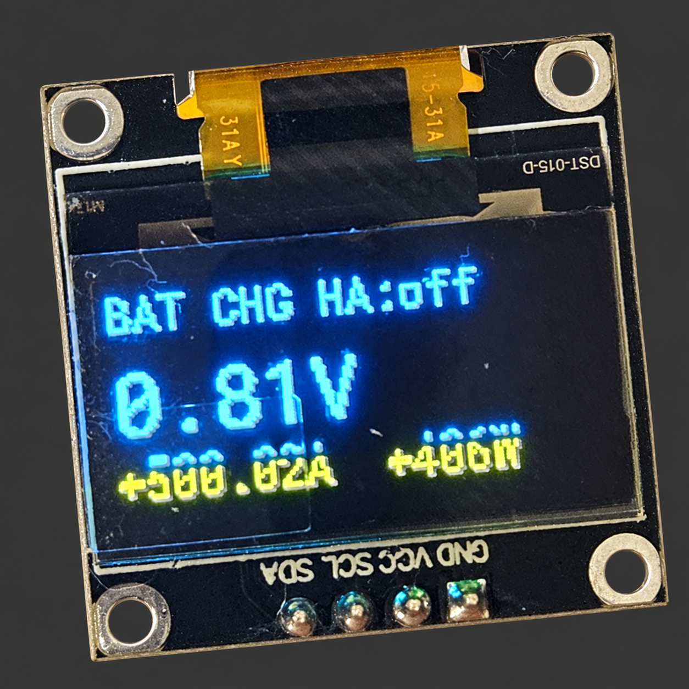
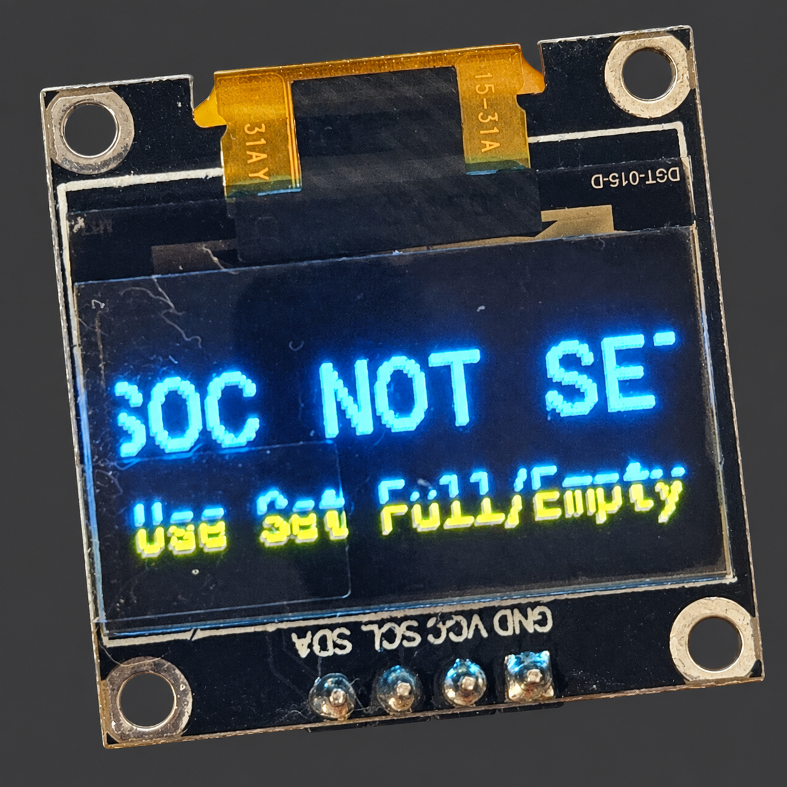
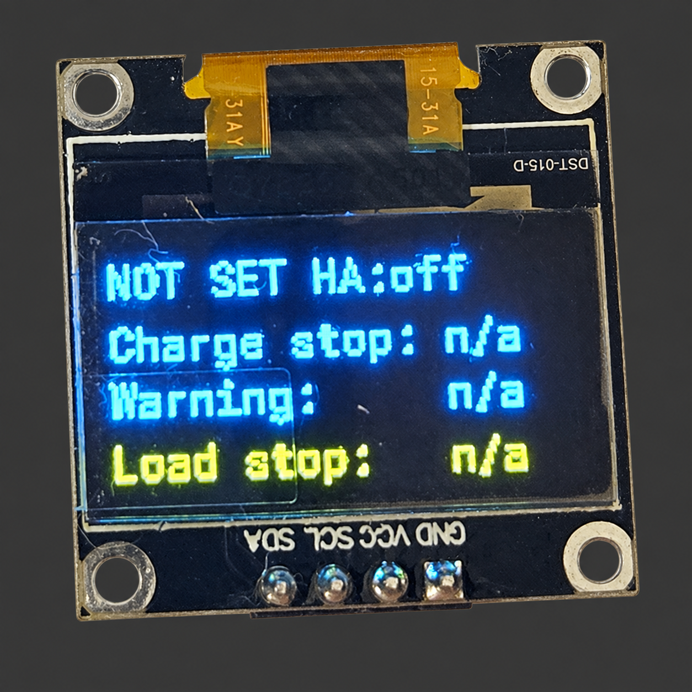
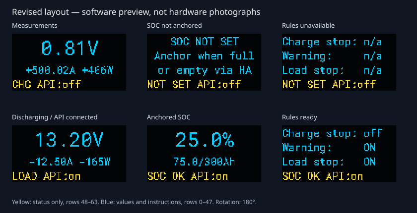

# OLED display and prototype photos

The monitor uses a 128×64 SSD1306 OLED. The photographed module has a fixed
yellow band covering 16 rows and a blue region covering the other 48. With the
default `oled_rotation: "180"`, yellow is at the **bottom** of the readable
screen. This is a physical property of the panel, not a software text color.

## Photographed prototype: earlier layout

These are **AI-enhanced documentation illustrations** derived from the user's
2026-09-10 photos: the hand/workbench background was removed. They show the
**earlier firmware layout**, including its clipped and mixed-color text. They
are not pixel-exact photographic evidence or photographs of the revised layout.
Use the linked original-pixel crops for article publication or close analysis.

| Measurements | SOC not anchored | Rules unavailable |
| --- | --- | --- |
|  |  |  |
| [Exact photo crop](images/display-measurements-original.png) | [Exact photo crop](images/display-soc-unset-original.png) | [Exact photo crop](images/display-rules-original.png) |

One full-resolution measurement photo is retained as a historical overview.
All three original-pixel crops and editing provenance are linked in
[`images/README.md`](images/README.md); the other two raw JPEGs remain in Git history.

The original photos reveal three layout issues:

- The current/power line starts inside the blue region and extends into yellow.
  Its letter tops and bottoms are different colors.
- `SOC NOT SET` is too wide in the large font. `Use Set Full/Empty` also straddles
  the color boundary, making the instruction harder to read.
- The rule page happens to highlight `Load stop` because it is last, even when
  all three rules are unavailable. Yellow should communicate a consistent
  status instead of emphasizing whichever line happens to occupy those pixels.

`NOT SET` and `n/a` are expected before SOC has been anchored and the rule engine
is ready; they are not equivalent to rules being `off`. The first photo appears
to show `0.81V`, `+500.02A`, and `+406W`. Those are observed screen readings,
**not validated battery measurements**. In particular, 0.81 V is not a normal
operating voltage for the documented 4S battery. Verify sensing, shunt scaling,
and reference readings through [`commissioning.md`](commissioning.md); the
photos alone cannot establish the cause or actual current flowing.

## Revised layout



This is a **software preview**, rendered from drawing calls and the bundled
font glyphs. Example states are illustrative; it is not a hardware test record.
New photos after flashing are still needed to confirm the result on the panel.

| Region at rotation 180° | Use |
| --- | --- |
| Blue, rows 0–47 | Large primary voltage or SOC, secondary values, or three compact text rows |
| Yellow, rows 48–63 | One status line: flow or SOC trust, followed by API connection state |

The shared [`display.yaml`](../packages/display.yaml) now uses these arrangements:

- **Measurements:** large voltage, signed current/power beneath it, and
  `CHG`/`LOAD`/`IDLE` plus API connection status in yellow.
- **SOC:** large percentage and remaining/rated Ah; yellow shows `SOC OK`,
  `SUSPECT`, `WAIT`, or `NOT SET`. Until anchored, the blue area reads
  `SOC NOT SET`, `Anchor when full`, `or empty via HA` on separate lines.
- **Rules:** Charge stop, Warning, and Load stop each occupy a full blue text
  row. Yellow carries SOC trust/readiness and API connection status. `ON` means
  that condition is asserted; `off` means clear; `n/a` means unavailable.
- **Missing measurements:** the rotating pages are replaced by
  `SENSOR`, `UNAVAILABLE`, and `Check INA219/I2C` on separate lines, with `SENSOR!`
  and the API state in yellow. Old numeric values are not displayed.

`SOC OK` describes the estimator's validity/plausibility and ready rule engine;
it does not mean that every rule is clear or that the battery is safe. `WAIT`
means SOC is set but the rule engine is not ready yet. `API:on` means the
firmware's API-connected status is true; a logging client can also contribute.
It is not a guarantee that Home Assistant automations are running successfully.

Only use the Home Assistant full/empty anchor at a verified battery endpoint,
as described in [`home-assistant-setup.md`](home-assistant-setup.md). The display
instruction is not a request to arbitrarily reset the estimate.

The nominal 12-pixel font actually has a **16-pixel line box**, and the 22-pixel
font has a **29-pixel line box** in the pinned ESPHome build. Small rows therefore
start 16 pixels apart, and the large number has a separate 32-pixel area. Long
SOC numbers fall back to the small font; values too wide even there display
`OUT OF RANGE`. Extreme Ah values use compact scientific notation. The stored
SOC and Home Assistant values remain unbounded; display formatting never clamps
them to 0–100%. ESPHome's
[font documentation](https://esphome.io/components/font/) and
[display alignment documentation](https://esphome.io/components/display/)
describe the rendering APIs.

## Orientation and verification

Use `oled_rotation: "180"` for the photographed mounting. If the module is
mounted the other way up, use `"0"`: the layout moves the yellow status row to
the top and shifts the blue content down by 16 rows. This two-band layout is
designed for **0° and 180° landscape orientation**, not 90°/270°. A monochrome
128×64 panel can use the same layout without a color distinction.

The change is in a shared package, so rebuild the entry point for the actual MCU:

```sh
esphome compile battery-monitor.yaml
# Or, for ESP8266:
esphome compile battery-monitor-esp8266.yaml
```

Before flashing, follow the existing build/secrets instructions in
[`getting-started.md`](getting-started.md) or
[`esp8266-migration.md`](esp8266-migration.md). After flashing, check:

- Each line stays entirely within one physical color, including lowercase
  descenders, minus signs, and the full/empty instructions.
- The complete `SOC NOT SET` heading and two-line `SENSOR` / `UNAVAILABLE`
  message are visible.
- Valid, negative, above-100%, and unusually long SOC values remain legible.
- The yellow status changes meaningfully between charge/load/idle, unanchored,
  ready, suspect, and measurement-unavailable states.
- Disconnecting Home Assistant **and** API log clients produces `API:off`,
  while measurement, SOC integration, and local rules continue operating.

Automated geometry checks execute the production display lambda across 54
state/orientation combinations using the build's actual glyph metrics. They
check text bounds, overlap, and band crossings, but do not replace these panel
checks or the full [`commissioning.md`](commissioning.md) procedure.
