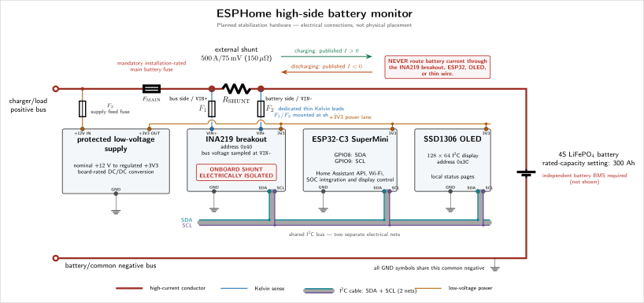
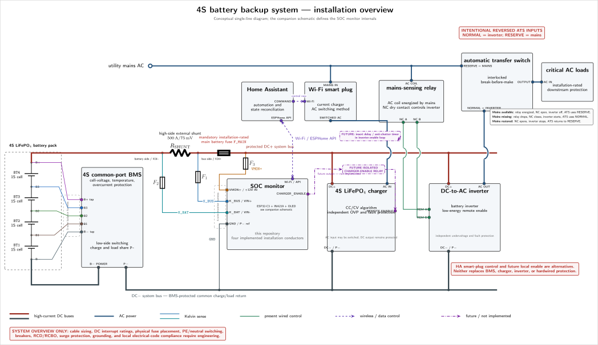

# Monitor wiring

This guide explains the electrical boundaries and connections of the battery
monitor. It is **not** a construction-ready cable, fuse, enclosure, grounding, or
code-compliance design.

> **Prototype status:** The complete physical monitor has not passed the project
> commissioning checklist. No real charger or load automation has been validated.

## Safety boundary

The monitor estimates battery state. It is not a BMS, fuse, disconnect, charger
protection, load protection, or safety-rated controller.

Before connecting the monitor to a battery, provide independently functioning:

- BMS cell-voltage, temperature, and overcurrent protection;
- a battery main fuse with suitable DC voltage and interrupt ratings;
- charger overvoltage and fault protection;
- load undervoltage and fault protection;
- correctly rated high-current conductors, bus bars, lugs, insulation, enclosure,
  strain relief, and disconnects; and
- a protected DC/DC supply rated for the actual battery range and transients.

**Never route battery or load current through the INA219 breakout, ESP32-C3,
OLED, a PCB relay, or a thin sense wire.** Main current flows only through the
external shunt and installation-rated high-current components.

A 300 Ah LiFePO4 battery can deliver destructive fault current. De-energize and
isolate the battery before changing conductors. Verify absence of hazardous
voltage with appropriate equipment. Use qualified assistance and personal
protective equipment when the installation requires it.

Read [`fuse-selection.md`](fuse-selection.md) before choosing `F_MAIN`, `F1`,
`F2`, `F3`, or their holders. A fuse's printed current alone does not establish a
safe DC interrupt rating.

## Monitor-only overview

```text
BATTERY B+ ── external 500 A / 75 mV shunt ── F_MAIN ── protected DC+ bus
              │ battery side      bus side │
              │                            │
              └── F2 ── K_BAT      K_BUS ── F1 ──┐
                                                  │
protected DC+ bus ── F3 ── VMON+ ──┐              │
protected DC- / BMS P- ─── GND ────┴── SOC monitor

BATTERY B- ── BMS B-
BMS P- ───── protected DC- bus
```

This drawing shows electrical relationships, not physical distances, wire sizes,
or an approved component layout. Install the main fuse and all branch protection
as close to their energy source as the complete installation design requires,
with unavoidable unfused lengths minimized and protected.

## Four installation conductors

Exactly four implemented conductors cross the SOC-monitor enclosure boundary:

| Logical ID | Monitor terminal | Installation connection                      | Purpose                                                                     |
| ---------- | ---------------- | -------------------------------------------- | --------------------------------------------------------------------------- |
| `K_BUS`    | `VIN+`           | Bus-side shunt Kelvin point through `F1`     | Positive differential-sense input                                           |
| `K_BAT`    | `VIN-`           | Battery-side shunt Kelvin point through `F2` | Negative differential-sense input and INA219 battery-voltage sampling point |
| `VMON+`    | `+12V IN`        | Protected DC+ bus through `F3`               | Protected monitor-supply input                                              |
| `GND`      | `P- ref`         | Protected DC- bus / BMS `P-`                 | Non-isolated supply and measurement reference                               |

The four wires can share a physical harness only if their insulation, protection,
routing, and separation are suitable. They remain four independent electrical
connections. Never use a Kelvin lead to carry monitor-supply current: fuse and
lead voltage drop would bias the shunt measurement.

## High-current path and polarity

Install the external shunt in the battery-positive conductor:

```text
charger/load positive bus ── VIN+ [external shunt] VIN- ── battery positive
common negative bus ────────────────────────────────────── battery negative/BMS
```

`VIN+` and `VIN-` identify the two **sense sides of the external shunt**. They do
not describe a high-current path through the INA219 PCB.

With the documented orientation:

- charging current flows from the protected positive bus through the shunt toward
  battery positive and is published as positive;
- discharging current flows from battery positive through the shunt toward the
  protected bus and is published as negative;
- INA219 bus voltage is sampled at the battery-side `VIN-` point relative to
  common negative; and
- ESP32-C3, INA219, OLED, supply, and protected DC- share a common reference in
  this non-isolated design.

Do not reverse public formulas to compensate for a wiring or raw-sign problem.
First verify current direction with a controlled reference. If every verified
raw reading has the opposite sign, change only `current_polarity_multiplier` in
[`../packages/battery-config.yaml`](../packages/battery-config.yaml) and rebuild.

The INA219 configuration value does not permit exceeding the voltage, common-mode,
power, connector, insulation, or PCB ratings of the actual hardware.

## Kelvin sense leads

Use two dedicated sense connections directly at the external shunt's designated
sense points:

```text
bus-side shunt sense point     ── F1 ── INA219 VIN+
battery-side shunt sense point ── F2 ── INA219 VIN-
```

Requirements:

1. Connect each lead directly to its shunt sense point, not farther along a
   high-current cable, bus bar, or load-carrying lug.
2. Place one correctly selected fuse in **each** lead as close as practical to
   the energized shunt tap.
3. Keep unfused pigtails extremely short, separated, insulated, and mechanically
   protected.
4. Route the pair together, keep it short, and avoid noisy switching conductors
   where practical.
5. Use fuses and holders with suitable wire-protection, DC voltage, and DC
   interrupt ratings for prospective fault current at the tap.
6. Never bridge the two Kelvin leads or use either lead as a supply conductor.
7. Verify polarity and reading accuracy at controlled low current before relying
   on SOC.

An open `F1` or `F2`, damaged lead, or poor sense connection is a measurement
fault. Stop relying on current, power, and SOC until both paths and the INA219
readings have been checked safely.

## Isolate the breakout's onboard shunt

The low-value current-sense resistor fitted to a typical INA219 breakout must not
remain connected across `VIN+` and `VIN-` when the external shunt is used.

Use only a method documented for the exact breakout revision:

- desolder the onboard shunt resistor;
- open a provided external-shunt solder jumper; or
- cut a manufacturer-identified link.

Do not cut an unidentified PCB trace. After modification, use the board schematic
and a de-energized resistance/continuity test to confirm both of these facts:

1. the onboard resistor no longer creates a low-resistance bridge between
   `VIN+` and `VIN-`; and
2. each INA219 input still reaches its corresponding external sense terminal.

A typical `0.1 ohm` onboard resistor would carry:

```text
0.075 V / 0.1 ohm = 0.75 A
```

That current would flow through thin Kelvin leads, fuses, connectors, and PCB
traces, corrupting the measurement and potentially overheating components.
Isolating the differential shunt does not disable INA219 bus-voltage measurement.

## Protected monitor supply

`VMON+` is fed from the protected bus side through `F3` into a board-rated DC/DC
converter. The converter output supplies the ESP32-C3, INA219, and OLED at their
required logic voltage. `GND` returns to protected DC- / BMS `P-`.

Taking monitor power from the measured bus side means battery-supplied monitor
consumption crosses the shunt and appears as discharge current.

The `+12V IN` label is nominal. It does not mean that the battery bus is a
regulated 12 V source. The converter and all input components must tolerate the
complete battery/charger voltage range and credible transients. Select `F3` from
measured continuous input current, startup inrush, wire and converter limits,
temperature derating, time-current behavior, and prospective fault current as
described in [`fuse-selection.md`](fuse-selection.md).

## I2C wiring

Photos of the connected OLED and its yellow/blue layout are in
[`display.md`](display.md). The yellow band is a fixed physical region; changing
text color in firmware cannot move it.

For the alternative ESP8266 target, use GPIO4 SDA and GPIO5 SCL as described in
[`esp8266-migration.md`](esp8266-migration.md). The table and schematics below
describe the default ESP32-C3 controller.

The default bus is:

| Signal      | ESP32-C3 default      | INA219 | OLED |
| ----------- | --------------------- | ------ | ---- |
| GND         | common GND            | GND    | GND  |
| Logic power | compatible 3.3 V rail | VCC    | VCC  |
| SCL         | GPIO1                 | SCL    | SCL  |
| SDA         | GPIO0                 | SDA    | SDA  |

The INA219 default address is `0x40`; the OLED default is `0x3C`. SDA and SCL are
two separate nets on one shared multidrop bus. Modules connect to both nets; they
are not a single interchangeable wire.

On the board edge described as `5V, G, 3V3, 4, 3, 2, 1, 0`, GPIO1 followed by
GPIO0 matches the OLED signal order SCL followed by SDA. GND and 3V3 are not
adjacent to that signal pair: GPIO4, GPIO3, and GPIO2 lie between 3V3 and GPIO1.
Do not treat the four OLED pins as a straight four-pin connection to the
controller. Wire each conductor by its signal label.

The defaults deliberately avoid GPIO2, GPIO8, and GPIO9, which Espressif lists as
ESP32-C3 strapping pins in its official
[GPIO summary](https://docs.espressif.com/projects/esp-idf/en/stable/esp32c3/api-reference/peripherals/gpio.html#gpio-summary).
Many I2C modules include pull-up resistors; using a strapping pin for the bus can
therefore alter its level while the chip samples the boot configuration. GPIO0
and GPIO1 avoid that interaction. The trade-off is that they cannot serve as ADC
inputs while assigned to I2C. GPIO4 through GPIO7 remain free for the conventional
external JTAG interface.

SuperMini layouts and onboard connections can vary. Verify the exact board
revision, 3.3 V pull-up compatibility, and combined pull-up strength, then test
repeated cold boot, reset, and power recovery with the actual modules attached.
See [`troubleshooting.md`](troubleshooting.md).

## De-energized inspection

Before battery connection, record and verify at least these items:

- [ ] The main current path cannot pass through the INA219 breakout or monitor.
- [ ] Battery/common negative and protected `P-` references match the documented
      non-isolated topology.
- [ ] `K_BUS` reaches only the bus-side shunt tap through `F1`.
- [ ] `K_BAT` reaches only the battery-side shunt tap through `F2`.
- [ ] Neither Kelvin lead carries supply or load current.
- [ ] `F1`, `F2`, `F3`, and `F_MAIN` have documented current, time-current, DC
      voltage, DC interrupt, holder, conductor, and environmental ratings.
- [ ] The onboard breakout shunt is isolated by a documented method.
- [ ] De-energized resistance/continuity measurements confirm no unwanted bridge
      remains and both INA219 sense inputs remain connected.
- [ ] The converter, controller, sensor, and display voltage ratings are compatible.
- [ ] No unfused energized lead is longer or less protected than the reviewed
      installation design permits.
- [ ] Independent BMS, charger, load, and main-fuse protection is installed and
      remains effective with the monitor disconnected.

The full acceptance record is in [`commissioning.md`](commissioning.md). A checked
wiring list alone does not establish measurement accuracy or operational safety.

## Detailed monitor schematic

[](../hardware/battery-monitor-schematic.svg)

The editable
[`../hardware/battery-monitor-schematic.tex`](../hardware/battery-monitor-schematic.tex)
is the source of truth. The committed SVG is provided for documentation viewers.
The schematic separates high-current, Kelvin-sense, logic-power, ground, SDA, and
SCL nets; it is not a PCB, enclosure, cable-sizing, or physical-placement drawing.

<details>
<summary>Optional whole-system and ATS context</summary>

The wider conceptual diagram shows one possible 4S battery backup system with
individual cells, a common-port low-side BMS, the high-side shunt, protected DC
buses, a charger, inverter, mains sensing, an automatic transfer switch, Home
Assistant, and the SOC monitor:

[](../hardware/battery-system-installation.svg)

Its editable source is
[`../hardware/battery-system-installation.tex`](../hardware/battery-system-installation.tex).

The diagram intentionally uses `NORMAL = inverter` and `RESERVE = mains`, which
is the reverse of common ATS labeling. The intended sequence is:

1. With mains present, the sensing relay is energized, its normally closed dry
   contact is open, the inverter is disabled, and the ATS uses reserve mains.
2. With mains absent, the relay drops out, the dry contact closes, the inverter
   starts, and the ATS uses its normal inverter input.
3. When mains returns, the relay opens the inverter-enable loop and the ATS returns
   to reserve mains.

Only an appropriately rated, interlocked, break-before-make ATS may be used. The
diagram does not specify neutral/PE switching, RCD/RCBO requirements, grounding,
surge protection, transfer timing, local-code compliance, or a UPS-grade transfer.

The currently documented charger-control route is Home Assistant commanding a
suitably rated AC smart plug or equivalent control interface. It has **not** been
validated on real equipment and depends on Wi-Fi, Home Assistant, and the
controlled device. The dashed local `CHARGER_ENABLE` output is future work and is
not implemented. Neither route replaces independent battery and charger safety.

</details>
