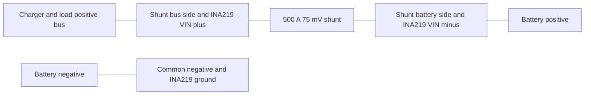

# Battery Monitor Stabilization Plan

## 1. Objective

Create a small, reproducible ESPHome battery monitor that compiles from a clean checkout, can be commissioned safely, and exposes a stable Home Assistant contract.

The result will replace the three prototypes with one canonical [`battery-monitor.yaml`](../battery-monitor.yaml). It will retain only the ESP32-C3, INA219 with external shunt, SSD1306 OLED, Wi-Fi, OTA, Home Assistant API, persistent coulomb counting, manual SOC anchoring, and configurable SOC rules.

## 2. Decisions and assumptions

| Topic | Stabilization decision |
|---|---|
| Battery profile | 4S LiFePO4 defaults, documented as editable rather than universal safety limits |
| Rated capacity | 300 Ah default; Ah is the canonical capacity unit |
| Shunt | 500 A / 75 mV external shunt, equal to 0.00015 ohm |
| Shunt topology | High-side, with the battery on the INA219 negative-input side and charger/load bus on the positive-input side |
| Current convention | Normalized positive current means charging; normalized negative current means discharging |
| Voltage source | INA219 bus voltage measured on the battery side of the high-side shunt |
| SOC model | Persistent, unbounded Ah-based coulomb counter |
| First boot | SOC is invalid until Set Full or Set Empty is explicitly invoked |
| Out-of-range SOC | Publish values below 0% and above 100%; additionally mark the estimate suspect rather than clamping it |
| Automatic anchoring | Not in stabilization; only explicit Set Full and Set Empty controls change the anchor |
| Rule delivery | Persistent condition entities are authoritative; sequence-tagged crossing events are supplementary notifications |
| Local switching | Not in stabilization; Home Assistant automations consume rule conditions and events |
| Secrets | Never committed; only a documented example is committed |

The 0.0015-ohm value in the current prototype is ten times too high for the selected shunt and must not be carried forward from [`shunt v2.yaml`](../shunt%20v2.yaml:74). The unrelated LiTime integration begins in [`shunt v2.yaml`](../shunt%20v2.yaml:38) and is explicitly outside this product.

## 3. Safety boundary

This monitor is supervisory instrumentation, not the battery's primary protection system.

- Keep a suitable BMS, main battery fuse, charger protection, and load protection.
- Never route traction or battery current through an INA219 breakout board.
- Electrically isolate the breakout's onboard shunt before attaching Kelvin sense leads to the 500 A shunt. Depending on the board, this means desoldering the resistor, opening an external-shunt jumper, or cutting the documented shunt link.
- Fuse both thin sense leads close to their high-current connection points.
- Verify the exact breakout schematic before modification; inexpensive boards vary.
- Keep ESP32 and INA219 ground at battery/common negative.
- Treat Home Assistant events and Wi-Fi as non-safety-rated notification paths.
- Do not let the stabilization firmware directly interrupt charging or load current.

## 4. Target repository layout

- [`battery-monitor.yaml`](../battery-monitor.yaml) — canonical entry point and package composition.
- [`packages/battery-config.yaml`](../packages/battery-config.yaml) — documented battery, shunt, polarity, and commissioning defaults.
- [`packages/connectivity.yaml`](../packages/connectivity.yaml) — Wi-Fi, API, OTA, fallback access, logging, and diagnostics.
- [`packages/measurement.yaml`](../packages/measurement.yaml) — I2C and INA219 measurements.
- [`packages/soc.yaml`](../packages/soc.yaml) — integration state, persistence, validity, and manual anchor controls.
- [`packages/soc-rules.yaml`](../packages/soc-rules.yaml) — compile-time rule definitions and durable event metadata.
- [`packages/display.yaml`](../packages/display.yaml) — OLED status pages.
- [`assets/fonts/`](../assets/fonts/) — a repository-owned copy of an OFL-compatible font plus its license.
- [`secrets.example.yaml`](../secrets.example.yaml) — syntactically valid placeholders and key-generation instructions.
- [`.github/workflows/esphome.yaml`](../.github/workflows/esphome.yaml) — validation and compile checks.
- [`docs/home-assistant.md`](../docs/home-assistant.md) — entity/event contract and automation examples.
- [`docs/commissioning.md`](../docs/commissioning.md) — wiring, calibration checks, and acceptance procedure.

The packages are implementation boundaries, not independent products. The default entry point must compile without copying external headers, downloading an unpinned project, or referring to absent local assets.

## 5. Physical connection specification

### 5.1 High-side current path

With this orientation, charger-to-battery current traverses the shunt from the INA219 positive input to its negative input and therefore reads as positive charging current. Battery-to-load current reads negative. A documented compile-time multiplier permits correcting boards or installations with the opposite raw sign without changing the public convention.

### 5.2 Sense and supply wiring

1. Use dedicated Kelvin connections directly at the shunt sense points, separate from voltage drops in high-current cable lugs.
2. Connect the bus-side Kelvin lead to the INA219 positive input.
3. Connect the battery-side Kelvin lead to the INA219 negative input.
4. Power the INA219 from the ESP32-C3-compatible logic rail and connect its ground to common negative.
5. Connect INA219 and SSD1306 to GPIO8 for SDA and GPIO9 for SCL by default.
6. Use default addresses 0x40 for INA219 and 0x3C for SSD1306, then verify both during commissioning.
7. Compare INA219 battery voltage to a trusted multimeter at the battery terminals before relying on endpoint telemetry.

A separate precision battery-voltage channel is deliberately deferred. It is only needed if accuracy testing rejects the INA219 result, galvanic isolation is required, or a later installation moves the shunt to the low side.

### 5.3 Why the onboard shunt must be isolated

Leaving a typical 0.1-ohm onboard resistor connected across the two sense inputs defeats true Kelvin sensing. At the external shunt's 75 mV full-scale drop, that resistor carries 0.75 A. The thin sense leads, fuses, connectors, and PCB traces then carry current and introduce installation-dependent voltage drops. Even though the ideal parallel-resistance error is only about 0.15%, lead resistance can cause a much larger and temperature-dependent measurement error.

After modification, verify with a multimeter and the board schematic that the onboard resistor no longer forms a low-resistance bridge, while each INA219 input remains connected to its respective sense terminal. Removing or isolating this differential shunt does not disable INA219 bus-voltage measurement from the negative differential input to ground.

## 6. Measurement contract

Publish these primary entities with correct Home Assistant device classes, state classes, units, precision, availability, and stable names:

- Battery voltage in volts.
- Raw shunt voltage in millivolts for diagnostics.
- Raw INA219 current in amperes as an internal or diagnostic entity.
- Normalized battery current in amperes, positive while charging.
- Signed battery power in watts, calculated from battery voltage and normalized current.
- Charging, discharging, and idle condition entities using a small configurable deadband.
- Device uptime, Wi-Fi signal, firmware version, reset reason where supported, and API connection status.

Implementation requirements:

1. Configure the INA219 for 500 A maximum current and 0.00015-ohm shunt resistance.
2. Apply sign normalization once; every downstream calculation consumes normalized current.
3. Reject non-finite sensor values and avoid integrating until both current and timing are valid.
4. Keep a responsive measurement stream separate from any display smoothing.
5. Do not use a long moving average as the coulomb-counting input because it can lose charge around startup and transitions.
6. Use a small zero-current deadband for state classification; do not silently discard current from integration until zero-offset behavior has been measured.
7. Publish unavailable rather than fabricated zero values when the INA219 is absent or stale.

## 7. Runtime battery configuration

[`packages/battery-config.yaml`](../packages/battery-config.yaml) will contain one prominently documented configuration section with:

- 4S LiFePO4 descriptive profile name.
- Rated capacity default of 300 Ah.
- Charging efficiency default selected conservatively and documented.
- Shunt rating of 500 A and 75 mV, with the derived 0.00015-ohm value shown beside it.
- Current polarity multiplier default for the recommended wiring.
- Plausibility limits for marking SOC suspect, kept distinct from rule levels and BMS cutoffs.
- Integration cadence, maximum accepted sample gap, persistence checkpoint cadence, current-state deadband, and startup stabilization duration.
- ESP32-C3 board, I2C pins, and device addresses.

Rated capacity and charging efficiency will be persistent Home Assistant number entities. Values must have guarded ranges and useful defaults. A capacity edit must preserve the currently displayed SOC percentage by rescaling remaining Ah, then update the persistent checkpoint; it must not silently reinterpret the same charge balance as a different SOC.

Hardware-defining values such as shunt resistance, pins, and polarity remain compile-time settings because changing them without reflashing would make measurements temporarily unsafe or misleading.

## 8. SOC state machine

### 8.1 State model

Maintain separate live and checkpointed state:

- Unbounded remaining-charge estimate in Ah.
- Unbounded SOC percentage derived from remaining Ah and rated capacity.
- Valid/initialized flag.
- Plausible/suspect flag derived from configurable limits.
- Last integration monotonic timestamp.
- Persistent checkpoint value and checkpoint metadata.

Positive normalized current adds charge after applying charging efficiency. Negative current removes charge without charging-efficiency compensation. The estimate is never clamped to 0–100%.

### 8.2 Initialization and controls

- On a genuinely fresh device, publish raw measurements but mark SOC invalid.
- Set Full assigns remaining Ah to rated capacity, sets SOC to 100%, marks it valid, and writes a checkpoint.
- Set Empty assigns remaining Ah to zero, sets SOC to 0%, marks it valid, and writes a checkpoint.
- Invalidate SOC preserves the diagnostic estimate but prevents it from being presented as trusted and suppresses crossing events.
- A restart restores validity and the latest checkpoint, then resumes integration only after valid current and timing samples arrive.

The display and Home Assistant must make invalid and suspect states visually distinct. Suspect does not mean unavailable: values such as -4% or 107% remain visible because they are important calibration evidence.

### 8.3 Timing and persistence safeguards

1. Use monotonic elapsed time for integration, including rollover-safe subtraction.
2. Ignore zero, negative, non-finite, or implausibly long sample intervals.
3. Cap or discard integration across reboot, sleep, unavailable-sensor, and debugger gaps; report a diagnostic counter for discarded gaps.
4. Update live state at the measurement cadence.
5. Write a persistent checkpoint at a bounded cadence and immediately after manual anchors, capacity changes, validity changes, and rule journal changes.
6. Structure flash writes so the live integration loop does not write on every sample.
7. Document the maximum charge-accounting loss possible between checkpoints after sudden power removal.

## 9. Compile-time SOC rule package

[`packages/soc-rules.yaml`](../packages/soc-rules.yaml) defines three named rules:

| Rule | Direction | Default level | Meaning |
|---|---:|---:|---|
| Stop Charge | Upward | 95% | Request Home Assistant to stop charging |
| Capacity Warning | Downward | 40% | Request a user notification |
| Stop Load | Downward | 30% | Request Home Assistant to stop discretionary loads |

Each rule has persistent runtime controls for level and hysteresis. Name, entity identity, and crossing direction are compile-time because ESPHome cannot create arbitrarily named entities at runtime. Adding another rule means adding another declarative block to the package and compiling firmware.

### 9.1 Hysteresis semantics

- An upward rule asserts when valid SOC reaches or exceeds its level and clears only when SOC falls to or below level minus hysteresis.
- A downward rule asserts when valid SOC reaches or falls below its level and clears only when SOC rises to or above level plus hysteresis.
- A configuration guard rejects nonsensical ranges and prevents rule thresholds from being silently reordered.
- Rule latches are restored or deterministically reconstructed so rebooting while SOC lies inside the hysteresis band does not invert a condition.

### 9.2 Startup and invalid-state behavior

1. Raw measurements start immediately.
2. Rule conditions remain unavailable while SOC is invalid.
3. After reboot, restore the SOC checkpoint and rule latch, wait for sensor stabilization, then publish the correct persistent condition without generating a synthetic crossing.
4. Threshold edits recompute persistent conditions but produce a distinct configuration-change record rather than pretending the battery crossed a threshold.
5. Valid but suspect out-of-range SOC still drives persistent conditions conservatively; the suspect entity tells Home Assistant that calibration needs attention.

## 10. Reliable Home Assistant delivery

### 10.1 Source of truth

Persistent rule condition entities are the source of truth for charger/load automations. Home Assistant automations must reconcile their output whenever:

- A condition changes.
- ESPHome becomes available.
- Home Assistant starts.
- The automation is reloaded.

This ensures that a missed transient event does not leave charging or a load in the wrong state.

### 10.2 Crossing event and durable metadata

For each real armed-to-asserted crossing:

1. Increment a persistent unsigned sequence counter.
2. Save the last rule identifier, direction, unbounded SOC snapshot, device uptime, wall-clock timestamp when valid, replay flag, and validity/suspect state.
3. Publish all metadata entities before emitting the Home Assistant event.
4. Emit one event with a stable event name and sequence-tagged payload.
5. On API reconnection, republish the journal metadata and emit a clearly marked replay of the last record.

Home Assistant stores the last consumed sequence and deduplicates both live and replayed events. A sequence wrap policy must be documented and tested.

The MVP journal guarantees recovery of current rule conditions and identification/replay of the latest crossing. It does not promise lossless history for multiple crossings during a long Home Assistant outage. That limitation must be explicit; a later ring buffer or external recorder can extend it.

## 11. OLED behavior

Retain the 128x64 SSD1306 without any LiTime fields. Suggested pages:

1. Battery voltage, normalized current, and signed power.
2. Unbounded SOC and remaining Ah.
3. SOC status, including NOT SET, SUSPECT, charging/discharging/idle, and active rule icons or short labels.
4. Connectivity/diagnostic page for Wi-Fi and sensor availability.

The display must tolerate unavailable values and must not render a missing sensor as zero. Add a locally stored OFL font and its license so clean builds do not depend on the absent font referenced by [`shunt v2.yaml`](../shunt%20v2.yaml:535).

## 12. Home Assistant contract and examples

Document:

- Stable entity names and unique identities.
- Measurement signs and units.
- Difference between SOC valid, SOC plausible, and rule condition state.
- Event name, payload schema, sequence behavior, replay behavior, and limitations.
- Example notification automation for Capacity Warning.
- Example charger automation driven by the persistent Stop Charge condition.
- Example discretionary-load automation driven by the persistent Stop Load condition.
- Startup and ESPHome-reconnect reconciliation triggers.
- Explicit statement that these examples do not replace a BMS or hardwired safety cutoff.

## 13. Removal and migration

Do not delete the prototypes before the canonical build is validated. After acceptance:

1. Record which useful behavior was migrated from [`shunt  v0.2.yaml`](../shunt%20%20v0.2.yaml:1), [`shunt (1).yaml`](../shunt%20%281%29.yaml:1), and [`shunt v2.yaml`](../shunt%20v2.yaml:1).
2. Remove all LiTime sensors, BLE tracking/client logic, load switch, query interval, substitutions, and custom header include.
3. Remove duplicate SOC implementations, duplicate calculated power entities, charge-time estimates, and commented experimental code.
4. Remove the three obsolete YAML entry points once their version-control history is sufficient for reference.
5. Rewrite [`README.md`](../README.md) around the canonical build, wiring, commissioning, Home Assistant behavior, and safety boundary.

## 14. Validation strategy

### 14.1 Automated validation

- Pin or explicitly document a supported ESPHome release.
- Validate YAML substitutions, packages, secrets fixture, local assets, and component schemas.
- Compile the default ESP32-C3 target in CI from a clean checkout.
- Scan committed files for non-placeholder credentials and obsolete LiTime identifiers.
- Where YAML lambdas remain, isolate pure calculations and provide deterministic test vectors or a small host-side test harness.

### 14.2 Bench and hardware acceptance

- I2C scan finds INA219 and OLED at documented addresses.
- Battery voltage agrees with a trusted multimeter within an agreed tolerance.
- Zero-current reading and drift are recorded after warm-up.
- Known charging current is positive and known discharging current is negative.
- Current agrees with a trusted reference at several magnitudes and both directions.
- Signed power follows voltage times normalized current.
- Fresh flash exposes SOC as invalid and emits no threshold crossings.
- Set Full and Set Empty establish exactly 100% and 0% without clamping later integration.
- SOC checkpoint and validity survive controlled reboot.
- Sudden power loss loses no more integration than the documented checkpoint bound.
- SOC can visibly exceed 100% and fall below 0%, becoming suspect.
- Every rule asserts, clears, and rearms at the documented hysteresis boundaries.
- Boot inside each hysteresis band preserves or reconstructs the correct latch without a false event.
- Home Assistant outage does not affect local condition evaluation.
- Reconnection republishes state and replays the latest sequence-tagged record; example automation deduplicates it.
- OLED displays measurements, invalid SOC, suspect SOC, and unavailable sensor states correctly.

## 15. Stabilization implementation checklist

- [ ] Create the canonical entry point and package layout.
- [ ] Add documented battery/hardware defaults and safe secret handling.
- [ ] Implement and validate INA219 measurement/sign normalization.
- [ ] Implement runtime capacity and efficiency controls.
- [ ] Implement live and checkpointed unbounded coulomb counting.
- [ ] Implement validity, plausibility, manual anchor, and invalidation entities.
- [ ] Implement the three-rule package and hysteretic latches.
- [ ] Implement durable latest-event metadata, sequence, live event, and reconnect replay.
- [ ] Implement the OLED pages with a local licensed font.
- [ ] Add Home Assistant contract and reconciliation examples.
- [ ] Add CI validation and clean compile.
- [ ] Complete the bench/hardware acceptance checklist.
- [ ] Remove prototypes and LiTime artifacts only after acceptance.

## 16. Definition of done

Stabilization is complete when a clean checkout compiles the default ESP32-C3 firmware, the documented high-side 500 A / 75 mV installation produces credible bidirectional measurements, first-boot SOC cannot masquerade as valid, unbounded SOC and checkpoints behave correctly, all three hysteretic rule conditions reconcile after restart/outage, the latest crossing can be deduplicated by sequence, the OLED is self-contained, and no LiTime or missing local dependency remains.
