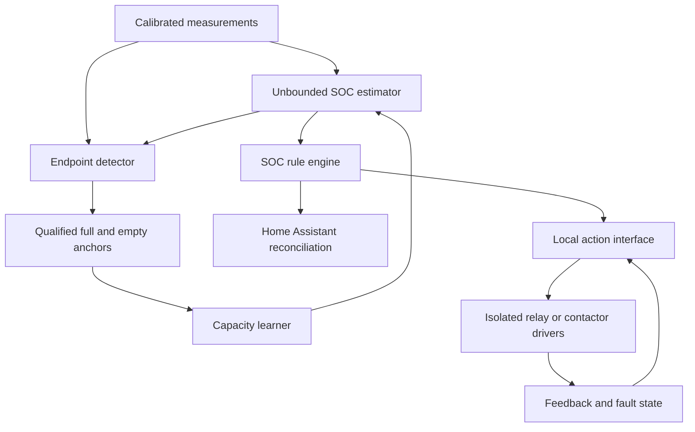

# Battery Monitor Evolution Plan

## 1. Objective

Evolve the stabilized monitor from a manually anchored Home Assistant sensor into a calibratable and increasingly self-contained battery monitor, without allowing heuristic corrections or network-dependent actions to become hidden safety assumptions.

This plan starts only after the acceptance criteria in [`01-stabilization-plan.md`](01-stabilization-plan.md) pass.

## 2. Guiding principles

1. Preserve raw evidence. Keep unbounded SOC, raw measurements, endpoint candidates, and pre-correction error visible.
2. Separate sensor calibration, SOC endpoint anchoring, and capacity learning; they solve different errors.
3. Never infer a genuinely full or empty battery solely because calculated SOC crossed 100% or 0%.
4. Require independent voltage, current direction, stability, and dwell evidence before automatic endpoint anchoring.
5. Keep rated capacity separate from learned usable capacity.
6. Make every automatic model change inspectable, reversible, and disableable.
7. Treat Home Assistant as an orchestration and observability layer, not the primary battery safety mechanism.
8. Introduce local switching only with correctly rated hardware, feedback, interlocks, and fail-safe behavior.

## 3. Target architecture

## 4. Phase A — observability before automation

Add telemetry needed to design and audit calibration:

- Raw and normalized current, shunt voltage, battery voltage, signed power, sample age, and discarded-gap counters.
- Integrated charge in each direction since boot, since last anchor, and between qualified endpoints.
- Unbounded remaining Ah, unbounded SOC, active capacity model, validity, plausibility, and confidence.
- Endpoint candidate state, voltage stability, current stability, dwell progress, tail-current test, low-voltage test, and rejection reason.
- Current zero offset, gain, noise estimate, deadband, voltage correction, and calibration version.
- Rated capacity, learned usable capacity, accepted-cycle count, last candidate capacity, and candidate rejection reason.
- Optional battery and ambient temperature once suitable sensors are selected.
- Event records for anchors, calibration changes, capacity proposals/acceptance, threshold crossings, stale sensors, and local-control faults.

Provide a structured recorder path through Home Assistant so real charge/discharge cycles can be exported and replayed. Do not tune endpoint logic only from hand-selected snapshots.

## 5. Phase B — explicit calibration mode

Calibration mode is a guarded workflow, not a continuously running correction.

### 5.1 Zero-current calibration

1. Require the operator to isolate chargers and loads or otherwise prove zero current externally.
2. Require stable shunt voltage and current samples for a configurable dwell.
3. Collect enough samples to calculate a robust center and noise distribution using a median or trimmed estimator.
4. Propose a zero offset and classification deadband based on measured noise plus bounded margins.
5. Reject calibration when samples drift, clip, contain dropouts, or exceed a maximum plausible zero-current window.
6. Let the operator review and accept the proposal.
7. Persist calibration version, time, sample count, statistics, and previous values for rollback.

Never run zero-current calibration merely because SOC is below 0% or above 100%; real battery current may be flowing then.

### 5.2 Known-current gain and polarity calibration

1. Ask the operator to apply one or more stable reference currents in charge and discharge directions.
2. Compare integrated and instantaneous INA219 measurements with a trusted meter or calibrated load/charger.
3. Fit bounded gain and offset terms and verify polarity.
4. Reject nonlinear, inconsistent, or thermally unstable samples.
5. Apply the correction in one canonical measurement stage so all consumers see the same current.

### 5.3 Voltage calibration

1. Compare INA219 bus voltage against a trusted multimeter at battery terminals over several voltage points where practical.
2. Fit bounded offset or linear correction.
3. Record wiring voltage drop separately from sensor error.
4. Reject automatic endpoint operation if voltage calibration is stale, unavailable, or outside acceptable residual error.

### 5.4 Calibration controls

Add guarded start, cancel, propose, accept, reset, and rollback controls. Calibration mode must visibly suspend automatic endpoint correction and capacity learning while leaving raw monitoring active.

## 6. Phase C — heuristic endpoint recovery

Crossing a plausibility boundary starts an observation/recovery state; it does not itself reset SOC.

### 6.1 Full endpoint qualification

A full candidate requires all of the following:

- Valid, calibrated voltage at or above the profile's full threshold.
- Positive normalized charging current before tailing.
- Current magnitude at or below a configured tail threshold, preferably expressed as both amperes and C-rate.
- Stable voltage and current within configured noise/slope limits.
- Continuous dwell long enough to reject transients and charger state changes.
- No sensor stale state, calibration mode, manual override, or contradictory discharge condition.
- Optional temperature inside the chemistry's permitted full-charge qualification range.

When qualified, record the pre-anchor unbounded SOC and error, set the model anchor to 100%, increment an anchor sequence, and retain the original estimate for diagnostics.

### 6.2 Empty endpoint qualification

An empty candidate requires all of the following:

- Valid, calibrated voltage at or below the configured low threshold.
- Negative normalized discharge context before qualification.
- Filtering or rest/rebound logic that distinguishes sustained depletion from temporary voltage sag under a large load.
- Stable voltage/current or a bounded load model for a configured dwell.
- No charger recovery, stale sensor, calibration mode, or contradictory charge condition.
- Optional temperature compensation or qualification range.

When qualified, record the pre-anchor estimate and error, set the model anchor to 0%, and retain all evidence.

### 6.3 Plausibility-triggered recovery behavior

If unbounded SOC moves outside configurable plausibility limits:

1. Keep publishing the value unchanged.
2. Assert suspect state and record the boundary crossing.
3. Increase endpoint telemetry and candidate evaluation frequency if safe.
4. Continue evaluating full and empty endpoint evidence independently.
5. Re-anchor only when one endpoint fully qualifies.
6. If neither endpoint qualifies, remain suspect and ask for manual inspection or anchoring.

Chemistry defaults seed full/empty thresholds. Observed cycles may propose bounded refinements to noise, sag, tail-current, and dwell parameters, but firmware must not freely learn BMS safety limits from SOC error.

## 7. Phase D — usable-capacity learning

### 7.1 Eligible cycles

Learn capacity only from charge integrated between qualified opposite endpoints:

- Qualified full to qualified empty for discharge capacity.
- Qualified empty to qualified full for charge acceptance, corrected by the selected efficiency model.

Reject or down-rank cycles with:

- Missing samples or excessive integration gaps.
- Reboots without adequately bounded checkpoints.
- Manual anchors between endpoints.
- Calibration changes during the cycle.
- Shallow or same-endpoint cycles.
- Temperature outside the configured learning range.
- Excessive self-discharge/storage duration unless modeled.
- Endpoint uncertainty, high voltage sag, current clipping, or implausible capacity.

### 7.2 Capacity model

- Preserve immutable configured rated capacity as the operator's baseline.
- Store learned usable capacity separately with cycle count and confidence.
- Bound each candidate against absolute Ah limits and a configurable percentage of rated capacity.
- Compare candidates with recent accepted cycles and reject outliers.
- Smooth accepted changes so one cycle cannot sharply alter SOC slope.
- Optionally maintain separate charge and discharge observations while choosing one documented operational capacity.
- Never overwrite rated capacity silently.

### 7.3 Operator controls and audit

Provide automatic-learning enable, proposal-only mode, accept/reject, reset learned value, rollback, and clear-history controls. Journal every proposal and applied change with endpoint records, integrated Ah, old/new capacity, confidence, and reason.

## 8. Phase E — voltage and current hardware evaluation

Evaluate the INA219 empirically before replacing it. Record:

- Resolution and noise with a 0.00015-ohm shunt.
- Offset drift over temperature and uptime.
- Accuracy across expected bidirectional current range.
- Bus-voltage accuracy against a trusted meter.
- Input common-mode limits, board layout constraints, and external-shunt wiring susceptibility.
- Current clipping behavior and recovery.
- ESPHome component maturity and calibration flexibility.

Compare optional alternatives such as a higher-resolution bidirectional current/power monitor and a protected precision voltage ADC channel. Selection criteria include accuracy, offset, isolation needs, common-mode range, supply compatibility, availability, maintainability, and ESPHome support.

If an external voltage channel is added:

- Protect and fuse its battery-positive sense path.
- Use an appropriately rated divider/front end and ADC input protection.
- Account for divider tolerance, ADC reference error, ground offset, and quiescent drain.
- Expose INA219 and precision-voltage readings concurrently during validation.
- Switch endpoint logic only after acceptance testing and explicit configuration.

## 9. Phase F — reusable profiles and rule expansion

Package battery chemistry as compile-time profiles containing descriptive defaults for voltage anchors, temperature limits, tail-current policy, dwell, and plausibility. Profiles are starting points, not replacements for manufacturer data or BMS settings.

Keep the rule list declarative and compile-time. Each rule defines a static identity and direction, while Home Assistant may edit enabled state, level, and hysteresis. Validate interactions among rules and expose an aggregate active-action state.

Do not claim support for arbitrary runtime entity names; adding named rules requires a firmware build unless a future external component and protocol explicitly support a dynamic registry.

## 10. Phase G — Home Assistant productization

Create a dashboard and automation blueprint that:

- Displays measurement quality, SOC validity/plausibility, active capacity, endpoint candidates, calibration status, and active rules.
- Reconciles persistent rule conditions on Home Assistant start, ESPHome reconnect, and automation reload.
- Stores the last handled sequence and deduplicates live/replayed events.
- Notifies on warnings and suspect/calibration states.
- Controls external charger-enable and discretionary-load entities from persistent conditions.
- Applies minimum on/off delays and explicit unknown/unavailable behavior.
- Keeps user notifications separate from equipment-control decisions.
- Records actions and failures for later audit.

Validate event-loss behavior explicitly. The persistent condition remains authoritative even if every transient event is missed.

## 11. Phase H — hardware-independent local action interface

Before selecting relays, define logical commands and feedback:

- Charger disable requested.
- Load disable requested.
- Notification requested.
- Manual override mode.
- Output command state.
- Auxiliary-contact feedback state.
- Command/feedback mismatch fault.
- Sensor stale fault.
- Interlock and recovery state.

Map rules to this interface rather than embedding GPIO operations in SOC calculations. Initially, a no-output adapter publishes commands to Home Assistant. Later, a local-output adapter drives selected hardware without changing rule semantics.

## 12. Phase I — isolated relay/contactor hardware

Do not switch the 500 A battery path with a small PCB relay. Prefer the charger's remote-enable input where available. For load isolation, select a DC-rated contactor or semiconductor solution for actual continuous current, interrupt current, voltage, inrush, duty cycle, temperature, and fault energy.

Hardware design review must cover:

- Galvanic isolation where required.
- Correctly rated coil or gate driver.
- Flyback, transient, and reverse-polarity protection.
- Main and control-circuit fusing.
- Normally open/closed behavior and loss-of-power outcome.
- Weld detection or auxiliary contact feedback.
- Manual emergency control.
- Creepage, clearance, conductor sizing, enclosure, and thermal design.
- Watchdog and stuck-output analysis.
- Separation between measurement wiring and switching noise.

## 13. Phase J — local control state machine

Only enable autonomous outputs after implementing and testing:

1. Boot policy that keeps outputs in a documented safe state until measurements and configuration are valid.
2. Stale-current, stale-voltage, invalid-SOC, suspect-SOC, and API-disconnected policies.
3. Separate assert and release conditions with hysteresis and minimum on/off times.
4. Command acknowledgement and auxiliary-feedback timeout.
5. Latched fault behavior for contactor mismatch or driver failure.
6. Manual override with expiry, clear indication, and restrictions around hard safety conditions.
7. Charger/load interlocks and deterministic recovery sequencing.
8. Local event journaling and Home Assistant state reconciliation.

The device must remain observable when local action is disabled or faulted.

## 14. Testability and possible external component

If package lambdas become difficult to reason about, move measurement calibration, integration, endpoints, capacity learning, rule latches, and event records into a versioned ESPHome external component with explicit interfaces.

Add host-side deterministic tests for:

- Positive and negative integration and efficiency.
- Timer rollover and long sample gaps.
- Reboot/checkpoint recovery.
- Invalid and suspect transitions.
- Full/empty candidate rejection and qualification.
- Voltage sag and rebound.
- Tail-current dwell interruption.
- Capacity candidate acceptance, bounds, smoothing, and rollback.
- Rule hysteresis and configuration changes.
- Sequence wrap, reconnect replay, and Home Assistant deduplication.
- Calibration sample contamination and rollback.
- Output interlocks, stale sensors, feedback timeout, and fault latching.

Use recorded telemetry replay before applying new heuristics to a live battery.

## 15. Staged validation gates

### Gate 1 — observe only

Collect telemetry with automatic anchoring, learning, and outputs disabled. Compare endpoint candidates with operator observations and BMS/charger behavior.

### Gate 2 — proposal only

Allow firmware to propose calibration, endpoints, and capacity changes without applying them. Review false positives and rejection reasons.

### Gate 3 — automatic anchoring

Permit bounded full/empty re-anchors after qualified evidence, while capacity learning remains proposal-only and local outputs remain disabled.

### Gate 4 — automatic capacity learning

Permit smoothed updates only after multiple accepted supervised cycles and demonstrated rollback.

### Gate 5 — shadow local control

Run the local action state machine with outputs disconnected; compare requested actions against Home Assistant automations and operator decisions.

### Gate 6 — supervised local actuation

Connect correctly rated hardware under controlled loads, test every fail-safe and feedback fault, then perform supervised battery operation.

### Gate 7 — autonomous operation

Enable only after documented fault injection, recovery, thermal, switching, and prolonged soak tests pass. Retain BMS and independent hardware protections.

## 16. Evolution implementation checklist

- [ ] Add structured telemetry, recorder/export, and replay fixtures.
- [ ] Implement guarded zero-current, known-current, polarity, and voltage calibration workflows.
- [ ] Implement qualified full and empty endpoint candidate state machines.
- [ ] Implement plausibility-triggered observation and evidence-based re-anchoring.
- [ ] Implement qualified-cycle capacity proposals, bounds, smoothing, confidence, and rollback.
- [ ] Evaluate INA219 performance and optional precision measurement hardware.
- [ ] Add reusable battery profiles and scalable compile-time rules.
- [ ] Add the Home Assistant dashboard, blueprint, sequence deduplication, and reconciliation.
- [ ] Define and exercise the hardware-independent local action interface.
- [ ] Design and review isolated, correctly rated relay/contactor hardware.
- [ ] Implement output interlocks, feedback, faults, override, and recovery sequencing.
- [ ] Extract a tested external component if package-level logic ceases to be auditable.
- [ ] Pass each staged validation gate before enabling the next capability.

## 17. Evolution definition of done

Evolution is complete when calibration changes are evidence-based and reversible, endpoint anchors require independent qualified conditions, learned capacity comes only from accepted complete cycles, out-of-range SOC remains visible and diagnosable, Home Assistant reliably reconciles state, optional precision hardware has measured justification, and any local charger/load command is executed through rated hardware with feedback, interlocks, fault handling, and independent battery protection still in place.
